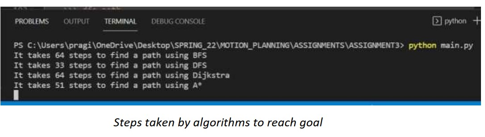

# Motion_Planning_Algorithms
Basic search, standard search and advanced motion planning algorithms are implemented and compared. 

Basic Search:
  BFS
  DFS
  Dijkstra
  A*

Standard Search:
  PRM with Gaussian sampling, random sampling, uniform sampling, bridge sampling
  RRT
  RRT*
  
Advanced Planning algorithms:
  Informed RRT*
  D star

#### RESULTS

